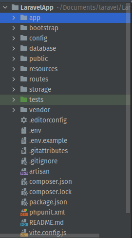

DIRECTORY STRUCTURE
=======================

The application structure in Laravel is basically the structure of folders, sub-folders and files included in a project.

Once we create a project in Laravel, we get an overview of the application structure as shown in the image here.

|

**The App Directory** -
The app directory contains the core code of your application.

**The Bootstrap Directory** -
The bootstrap directory contains the app.php file which bootstraps the framework. This directory also houses a cache directory which contains framework generated files for performance optimization such as the route and services cache files. You should not typically need to modify any files within this directory.

**The Config Directory** -
The config directory, as the name implies, contains all of your application's configuration files.

**The Database Directory** -
The database directory contains your database migrations, model factories, and seeds.

**The Public Directory** -
The public directory contains the index.php file, which is the entry point for all requests entering your application and configures autoloading. This directory also houses your assets such as images, JavaScript, and CSS.

**The Resources Directory** -
The resources directory contains your views as well as your raw, un-compiled assets such as CSS or JavaScript.

**The Routes Directory** -
The routes directory contains all of the route definitions for your application. By default, several route files are included with Laravel: web.php, api.php, console.php, and channels.php.

**The Storage Directory** -
The storage directory contains your logs, compiled Blade templates, file based sessions, file caches, and other files generated by the framework. This directory is segregated into app, framework, and logs directories.

**The Tests Directory** -
The tests directory contains your automated tests. Example PHPUnit unit tests and feature tests are provided out of the box.

**The Vendor Directory** -
The vendor directory contains your Composer dependencies.

