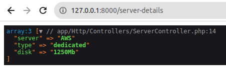

SERVICE PROVIDERS
===================

Service providers are the central place of all Laravel application bootstrapping. Your own application, as well as all of Laravel's core services, are bootstrapped via service providers.

CREATE SERVICE PROVIDERS
-----------------------------------

**Step 1 :**

Run the below artisan command to create a new provider :

.. code-block:: bash

   php artisan make:provider SiteServiceProvider

This will create new provider class at app/Providers/SiteServiceProvider.php file, with the following code :

.. code-block:: php

   <?php

   namespace App\Providers;

   use Illuminate\Support\ServiceProvider;

   class SiteServiceProvider extends ServiceProvider
   {
    /**
     * Register services.
     *
     * @return void
     */
    public function register()
    {
        //
    }

    /**
     * Bootstrap services.
     *
     * @return void
     */
    public function boot()
    {
        //
    }
   }

REGISTER SERVICE PROVIDER
-------------------------------------

**Step 2 :**

As we have created new provider class, but the application doesn't know about it. So we need to add new provider in config/app.php file with list of all provider class.

.. code-block:: php

   <?php

   return [

    'providers' => [
        ...

        App\Providers\SiteServiceProvider::class,

        ...
    ]
   ]

USE OF SERVICE PROVIDER
---------------------------

**Step 3 :**

The class generally includes two methods, register method and boot method. In register method, we can do implementation of App/Repo/SiteRepo in the service container. In the register method, you will always have access of $app property which provides access for service container.

Write the following code in app/Providers/SiteServiceProvider.php :

.. code-block:: php

   <?php

   namespace App\Providers;

   use App\Repo\SiteRepo;
   use Illuminate\Support\ServiceProvider;

   class SiteServiceProvider extends ServiceProvider
   {
    /**
     * Register services.
     *
     * @return void
     */
    public function register()
    {
        $this->app->bind('SiteRepo', function($app) {
            return new SiteRepo();
        });
    }
   }

After registering SiteRepo class we can use this class.

So we need to create this class. A details method will return server details for the website.

.. code-block:: php

   <?php

   namespace App\Repo;

   use App\Repo\SiteRepo;

   class SiteRepo
   {
    /**
     * return site details
     *
     * @return void
     */
    public function details()
    {
        return [
            'server' => 'AWS',
            'type' => 'dedicated',
            'disk' => '1250Mb',
        ];
    }
   }

Now use SiteRepo class in controller file like this :

.. code-block:: php

   <?php

   namespace App\Http\Controllers;

   use App\Repo\SiteRepo;
   use App\Http\Controllers\Controller;

   class ServerController extends Controller
   {
    public function index(SiteRepo $siterepo)
    {
        $server_details = $siterepo->details();

        dd($server_details);
    }
   }

Create route in routes/web.php file to access details.

.. code-block:: php

   <?php

   use App\Http\Controllers\ServerController;

   Route::get('server-details', [ServerController::class, 'index'])->name('index');

Now when you visit this route, you will get server details as defined in SiteRepo class.

