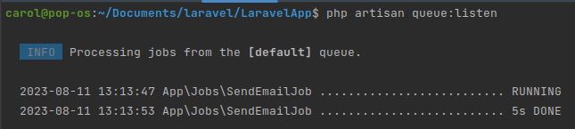
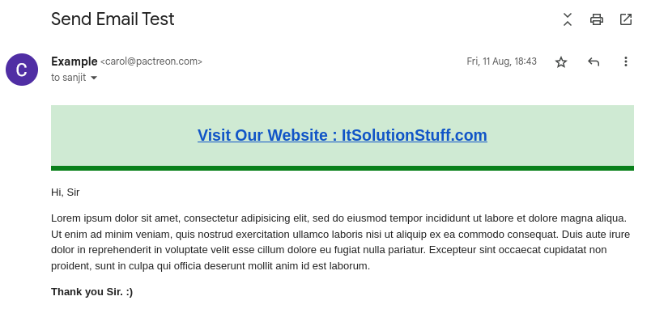

JOBS (QUEUES)
================

This documentation shows a simple example to create job with database driver for test email sending.

CREATE LARAVEL PROJECT
------------------------

**Step 1 : Run the following command to create laravel project**

.. code-block:: bash

   composer create-project --prefer-dist laravel/laravel blog

CREATE MAIL SETUP
--------------------

**Step 2 :**

We will create email for testing using Laravel Mail facade.

.. code-block:: bash

   php artisan make:mail SendEmailTest

Now you will have new folder "Mail" in app directory with SendEmailTest.php file.

Copy the code and paste on that file.

app/Mail/SendEmailTest.php

.. code-block:: php

   <?php

   namespace App\Mail;

   use Illuminate\Bus\Queueable;
   use Illuminate\Contracts\Queue\ShouldQueue;
   use Illuminate\Mail\Mailable;
   use Illuminate\Queue\SerializesModels;

   class SendEmailTest extends Mailable
   {
    use Queueable, SerializesModels;

    /**
     * Create a new message instance.
     *
     * @return void
     */
    public function __construct()
    {

    }

    /**
     * Build the message.
     *
     * @return $this
     */
    public function build()
    {
        return $this->view('emails.test');
    }
   }

Now we require to create email view using blade file. So we will create simple view file and copy below code on following path.

resources/views/emails/test.blade.php

.. code-block:: php

   <!DOCTYPE html>
   <html>
   <head>
    <title>How to send mail using queue in Laravel 8? - ItSolutionStuff.com</title>
   </head>
   <body>

   

   <h2 style="padding: 23px;background: #b3deb8a1;border-bottom: 6px green solid;">
    <a href="https://itsolutionstuff.com">Visit Our Website : ItSolutionStuff.com</a>
   </h2>
   

   
Hi, Sir

   
Lorem ipsum dolor sit amet, consectetur adipisicing elit, sed do eiusmod
   tempor incididunt ut labore et dolore magna aliqua. Ut enim ad minim veniam,
   quis nostrud exercitation ullamco laboris nisi ut aliquip ex ea commodo
   consequat. Duis aute irure dolor in reprehenderit in voluptate velit esse
   cillum dolore eu fugiat nulla pariatur. Excepteur sint occaecat cupidatat non
   proident, sunt in culpa qui officia deserunt mollit anim id est laborum.

   <strong>Thank you Sir. :)</strong>

   </body>
   </html>

After configuration of view file, we have to setup for email send, So set configuration in .env file:

.env

.. code-block:: php

   MAIL_DRIVER=smtp
   MAIL_HOST=smtp.gmail.com
   MAIL_PORT=587
   MAIL_USERNAME=xyz@gmail.com
   MAIL_PASSWORD=123456
   MAIL_ENCRYPTION=tls

.. note:: Add your email and password to verify.

CONFIGURATION
---------------

**Step 3 : Configuration of Queue**

We will make configuration on queue driver and set queue driver "database", define database driver on ".env" file:

.env

.. code-block:: php

   QUEUE_CONNECTION=database

After that we need to generate migration and create tables for queue. Run below commands for queue database tables:

Generate Migration:

.. code-block:: bash

   php artisan queue:table

Run Migration:

.. code-block:: bash

   php artisan migrate

CREATE AND RUN JOB
--------------------------

**Step 4 : Create Queue Job**

Create queue job by following command :

.. code-block:: bash

   php artisan make:job SendEmailJob

Now you have SendEmailJob.php file in "Jobs" directory. Put below code on that file.

app/Jobs/SendEmailJob.php

.. code-block:: php

   <?php

   namespace App\Jobs;

   use Illuminate\Bus\Queueable;
   use Illuminate\Contracts\Queue\ShouldQueue;
   use Illuminate\Foundation\Bus\Dispatchable;
   use Illuminate\Queue\InteractsWithQueue;
   use Illuminate\Queue\SerializesModels;
   use App\Mail\SendEmailTest;
   use Illuminate\Support\Facades\Mail;
   use Mail;

   class SendEmailJob implements ShouldQueue
   {
    use Dispatchable, InteractsWithQueue, Queueable, SerializesModels;

    protected $details;

    /**
     * Create a new job instance.
     *
     * @return void
     */
    public function __construct($details)
    {
        $this->details = $details;
    }

    /**
     * Execute the job.
     *
     * @return void
     */
    public function handle()
    {
        $email = new SendEmailTest();
        Mail::to($this->details['email'])->send($email);
    }
    }

**Step 5 : Test Queue Job**

Create route with following code for testing created queue.

routes/web.php

.. code-block:: php

   Route::get('email-test', function(){

    $details['email'] = 'your_email@gmail.com';

    dispatch(new App\Jobs\SendEmailJob($details));

    dd('done');
   });

.. note:: In "$details['email']" provide an email id on which mail will be sent to verify.

Route is defined, check queue process using laravel queue command :

.. code-block:: bash

   php artisan queue:listen

You will see layout like below if queue works :

Run project using below command :

.. code-block:: bash

   php artisan serve

Now run your project on below link :

.. code-block:: bash

   http://localhost:8000/email-test

.. image:: images/img_1.png

A successful job will result in the mail being sent

