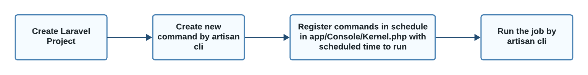
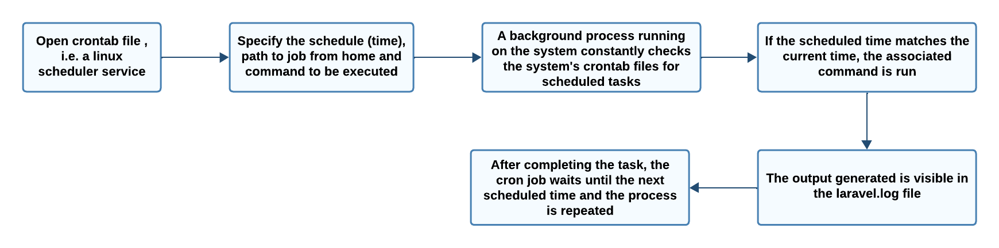

CRON JOBS
=============

INTRODUCTION
---------------

Cron job refers to a scheduled task that is executed automatically at specified intervals by the server's cron scheduler. Cron jobs are used to automate repetitive tasks, such as running scheduled tasks, sending emails, generating reports, and performing maintenance activities.

WORKFLOW OF SCHEDULING JOBS
-----------------------------

CREATE LARAVEL PROJECT
-------------------------

**Step 1 :**

Run the following command to create laravel project :

.. code-block:: bash

   composer create-project --prefer-dist laravel/laravel cronjobs

CREATE NEW COMMAND
----------------------

**Step 2 :**

Create custom command,it will execute with task scheduling cron job. Run below command to create a new custom command.

.. code-block:: bash

   php artisan make:command DemoCron --command=demo:cron

**Step 3 :**

Add the following code in app/Console/Commands/DemoCron.php :

.. code-block:: php

   <?php

   namespace App\Console\Commands;

   use Illuminate\Console\Command;
   use Illuminate\Support\Facades\Http;
   use App\Models\User;

   class DemoCron extends Command
   {
    /**
     * The name and signature of the console command.
     *
     * @var string
     */
    protected $signature = 'demo:cron';

    /**
     * The console command description.
     *
     * @var string
     */
    protected $description = 'Command description';

    /**
     * Create a new command instance.
     *
     * @return void
     */
    public function __construct()
    {
        parent::__construct();
    }

    /**
     * Execute the console command.
     *
     * @return int
     */
    public function handle()
    {
        info("Cron Job running at ". now());

        /*------------------------------------------
        --------------------------------------------
        Write Your Logic Here....
        I am getting users and create new users if not exist....
        --------------------------------------------
        --------------------------------------------*/
        $response = Http::get('https://jsonplaceholder.typicode.com/users');

        $users = $response->json();

        if (!empty($users)) {
            foreach ($users as $key => $user) {
                if(!User::where('email', $user['email'])->exists() ){
                    User::create([
                        'name' => $user['name'],
                        'email' => $user['email'],
                        'password' => bcrypt('123456789')
                    ]);
                }
            }
        }

        return 0;
    }
   }

REGISTER AS TASK SCHEDULER
-----------------------------

**Step 4 :**

Add the following code in app/Console/Kernel.php :

.. code-block:: php

   <?php

   namespace App\Console;

   use Illuminate\Console\Scheduling\Schedule;
   use Illuminate\Foundation\Console\Kernel as ConsoleKernel;

   class Kernel extends ConsoleKernel
   {
    /**
     * Define the application's command schedule.
     *
     * @param  \Illuminate\Console\Scheduling\Schedule  $schedule
     * @return void
     */
    protected function schedule(Schedule $schedule)
    {
        $schedule->command('demo:cron')
                 ->everyMinute();
    }

    /**
     * Register the commands for the application.
     *
     * @return void
     */
    protected function commands()
    {
        $this->load(__DIR__.'/Commands');

        require base_path('routes/console.php');
    }
   }

RUN SCHEDULER COMMAND FOR TEST
-----------------------------------

**Step 5 :**

Run the job manually using the following command :

.. code-block:: bash

   php artisan schedule:run

WORKFLOW OF CRON JOBS
-------------------------

CRON JOB SET UP ON SERVER
-----------------------------

**Step 6 :**

To set up a cron job, add a new entry to your server's cron tab file. Run the following command to open crontab file :

.. code-block:: bash

   crontab -e

**Step 7 :**

It will open the Crontab file, and you need to assimilate the following code in the same file.

Don’t forget to replace /path/to/artisan with the full path to the custom Artisan command of the Laravel project.

.. code-block:: bash

   * * * * * cd /your-project-path && php artisan schedule:run >> /dev/null 2>&1

.. note::

   For Nano Editor:

   - Press Ctrl + O to write changes.
   - Press Enter to confirm the file name.
   - Press Ctrl + X to exit.

**Step 8 :**

Check log file in storage/logs/laravel.log

.. image:: images/img.png

.. note::

   Jobs dispatched from scheduled commands and cron jobs in Laravel are typically sent directly to the queue system (such as Redis, Beanstalkd, or others) without passing through Horizon.

   Horizon focuses on monitoring queues and jobs managed through Laravel's queue system, not specifically those dispatched from scheduled commands, therefore they are not shown in the laravel horizon dashboard.