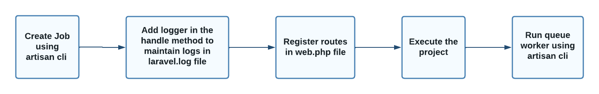
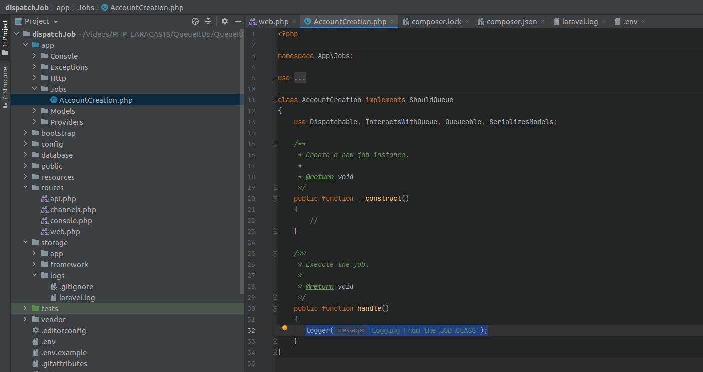

Job Classes and Daemons
========================

WORKFLOW
------------

CREATE JOB
------------

1. Create a job using php artisan

.. code-block:: bash

   php artisan make:job AccountCreation

.. image:: images/creatingAJOB.png

ADD LOGGER
-------------

2. In app/Jobs/AccountCreation.php add the logger in the handle method

.. code-block:: javascript

   logger('Any Log Message');

ADD ROUTES
-------------

3. In the routes/web.php instead of the closure function instantiate the job class ( i.e AccountCreation ) as our job

.. code-block:: javascript

   use App\Jobs\AccountCreation;

   Route::get('/', function () {
      dispatch(new AccountCreation) ;
       return 'Trying to dispatch a job';
   });

EXECUTE
------------

4. Run the code and the job handler in two different terminals

.. code-block:: bash

   php artisan serve

.. code-block:: bash

   php artisan queue:work

Check storage/logs/laravel.log

