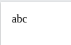

ITERABLE
===========

An iterable is any value which can be looped through with a foreach() loop.

.. note::

   The iterable keyword can be used as a data type of a function argument or as the return type of a function.

Example
---------

.. code-block:: php

   <?php
   function printIterable(iterable $myIterable) {
   foreach($myIterable as $item) {
    echo $item;
   }
   }

   $array = ["a", "b", "c"];
   printIterable($array);
   ?>

Result :

