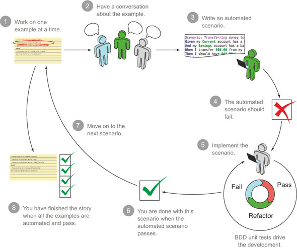
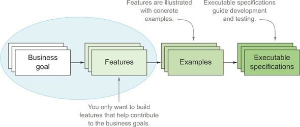
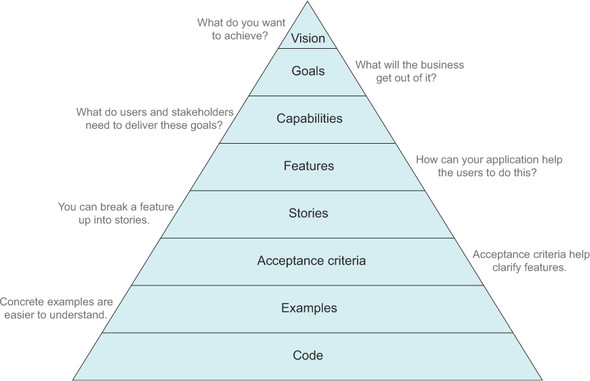

INTRODUCTION TO BEHAT
========================

Behat is an open source Behavior Driven Development (BDD) framework for PHP 5.3+.

BDD is a methodology for developing software through continuous example-based communication between developers and a business, which this application supports.

It is a tool to close the BDD communication loop and to save time.

This communication happens in a form that both the business and developers can clearly understand.

It is written in a special format called Gherkin.

BDD places great emphasis on building “software that matters” and defines several processes for turning client requirements into something that developers can use to code against and that accurately reflects the core values of the software the client wants.

All features, and ultimately all code should map back to business goals and the project vision.

