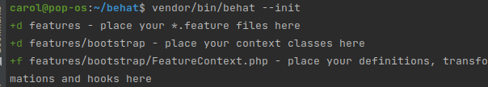
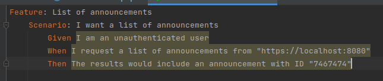
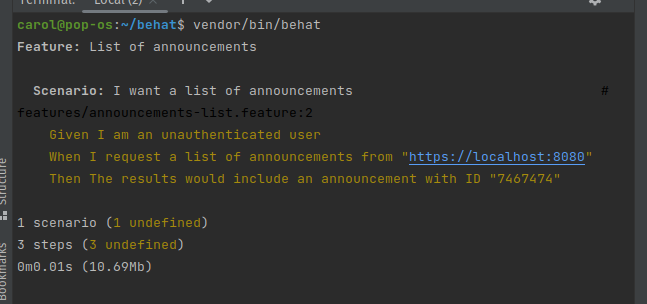

RUNNING BEHAT
====================

SETTING UP BEHAT
------------------

1. After you have installed PHP and Composer, you may create a new Laravel project in terminal via the Composer create-project command :

.. code-block:: bash

   composer create-project laravel/laravel{project_name}

.. image:: images/img.png

2. Download behat in the project

.. code-block:: bash

   composer require behat/behat 3.*

.. image:: images/img_1.png

3. Download guzzle

.. code-block:: bash

   composer require guzzlehttp/guzzle

.. image:: images/img_2.png

4.To check the version of behat

.. code-block:: bash

   vendor/bin/behat -V

INITIALISE AND EXECUTE PROJECT
---------------------------------

5. To initialise the project

.. code-block:: bash

   vendor/bin/behat --init

6. To execute the project

.. code-block:: bash

   vendor/bin/behat

.. image:: images/img_5.png

7. Create new file in features

.. image:: images/img_6.png

8. Write the scenario in the file created

.. code-block:: php

   Feature: List of announcements
    Scenario: I want a list of announcements
        Given I am an unauthenticated user
        When I request a list of announcements from "http://localhost:8080"
        Then The results would include an announcement with ID "7467474"

9. Run the project

.. code-block:: bash

   vendor/bin/behat

10. Create context and copy and paste these methods in feature context file

11. Check in announcements-list.feature, feature exists and it turns to blue colour

.. image:: images/img_10.png

12.Execute the project , it should show error because of pending exception

.. code-block:: bash

   vendor/bin/behat

.. image:: images/img_11.png

13. Import pending exception to remove fatal error

.. code-block:: php

   use Behat\Behat\Tester\Exception\PendingException;

14. Execute the project again, highlighted text will change its colour from red to yellow

.. image:: images/img_13.png

15. Make a call to API

.. code-block:: php

   $client = new GuzzleHttp\Client(['base_uri'=>'http://localhost:8080']);

        $response = $client->get (uri:'/');

        $responseCode = $response->getStatusCode();

        if ($responseCode !=200) { throw new Exception (message:"Not able to access!");
        }

        return true;

16. Execute the project again,"Given I am an unauthenticated user" will change its colour from yellow to green showing it is verified

.. image:: images/img_15.png

17. Make a call to next command

.. code-block:: php

   $client = new GuzzleHttp\Client(['base_uri'=>$arg1]);

       $this->response = $client->get(uri: '/announcements/');

       $responseCode = $this->response ->getStatusCode();

       if ($responseCode!=200 ){throw new Exception (message: "Expected a 200, but received".
       $responseCode);
       }
       return true ;

.. image:: images/img_16.png

18. Execute the project again,"When I request a list of announcements from" will change its colour from yellow to green showing it is verified.

.. image:: images/img_18.png

