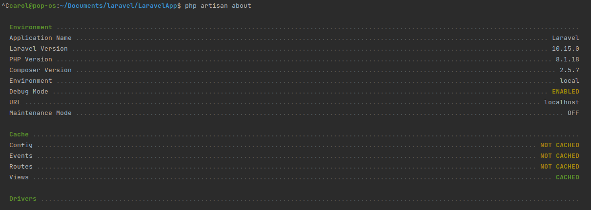
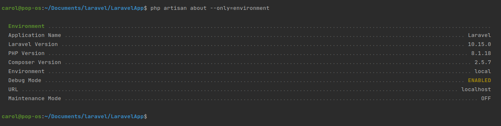
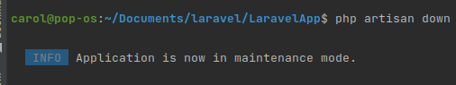
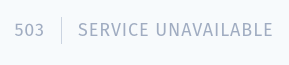
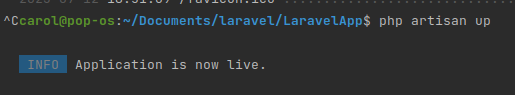
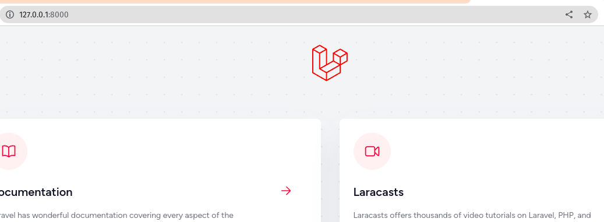

CONFIGURATION
===============

APPLICATION OVERVIEW
------------------------

You can get a quick overview of your application's configuration, drivers, and environment via the about Artisan command :

.. code-block:: bash

   php artisan about

If you're only interested in a particular section of the application overview output, you may filter for that section using the --only option :

.. code-block:: bash

   php artisan about --only=environment

MAINTENANCE MODE
------------------

Sometimes you may need to update some configuration values or perform maintenance on your website.

In such cases, keeping it in maintenance mode, makes it easier for you.

Such web applications which are kept in maintenance mode, throw an exception namely MaintenanceModeException with a status code of 503.

You can enable the maintenance mode on your Laravel web application using the following command :

.. code-block:: bash

   php artisan down

The following screenshot shows how the web application looks when it is down :

Once you finish working on updates and other maintenance, you can disable the maintenance mode on your web application using following command :

.. code-block:: bash

   php artisan up

Now, you can find that the website shows the output with proper functioning and depicting that the maintenance mode is now removed as shown below :

