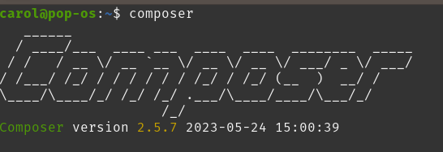
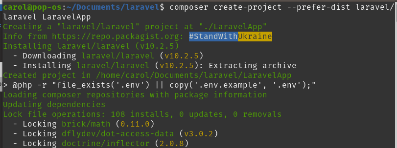
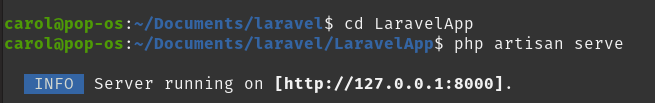
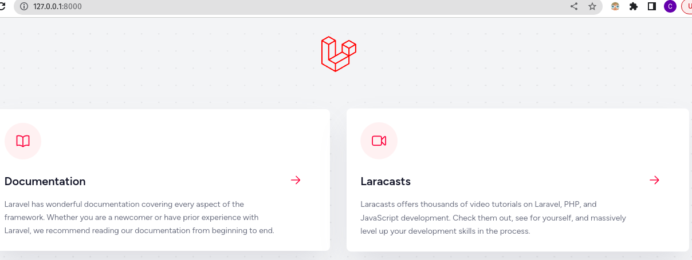

INSTALLATION
=================

Before creating your first Laravel project, you should ensure that your local machine has PHP and Composer installed.

After the Composer is installed, check the installation by typing the Composer command in the command prompt as shown in the following screenshot.

Create a new directory anywhere in your system for your new Laravel project.

After that, move to path where you have created the new directory and type the following command there to install Laravel and you may create a new Laravel project.

.. code-block:: bash

   composer create-project --prefer-dist laravel/laravel LaravelApp

After the project has been created, start Laravel's local development server by executing the following command.

.. code-block:: bash

  cd LaravelApp

  php artisan serve

Once you have started the Artisan development server, your application will be accessible in your web browser at http://127.0.0.1:8000.

