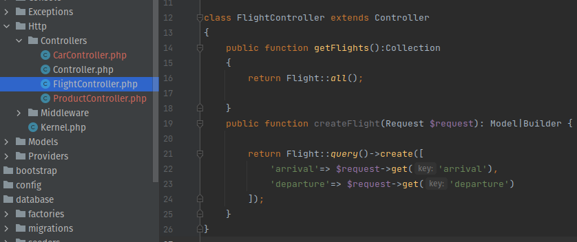
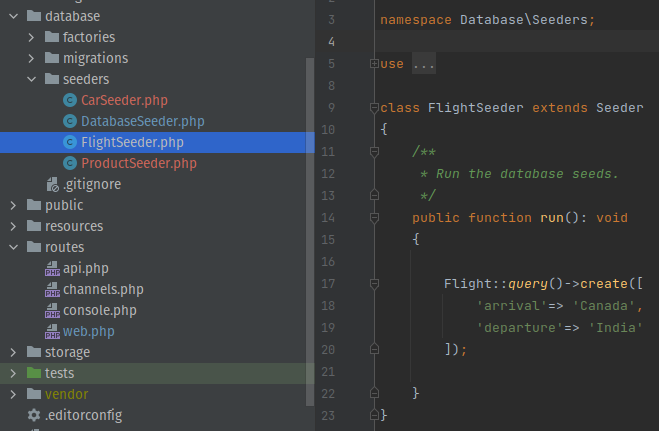

ELOQUENT CRUD
===============

Below documentation created a GET and POST API

CREATE MODEL
--------------

**Step 1 : Published Model, Migration, Controller and Seeder.**

Models are created in the app\Models directory and extend the Illuminate\Database\Eloquent\Model class.

Use the make:model Artisan command to generate a new model, migration, controller and seeder.

.. code-block:: bash

   php artisan make:model Flight -mcs

.. image:: images/img.png

**Step 2 : Write Migration File**

Migration file contains the schema of the table.

In database/migrations/2023_08_02_140928_create_flights_table.php :

.. code-block:: php

    public function up(): void
    {
        Schema::create('flights', function (Blueprint $table) {
            $table->id();
            $table->string('arrival');
            $table->string('departure');
            $table->timestamps();
            $table->softDeletes();
        });
    }

.. image:: images/img_12.png

**Step 3 : Write Controller.**

In app/Http/Controllers/FlightController.php :

.. code-block:: php

   class FlightController extends Controller
   {
    public function getFlights():Collection
    {
        return Flight::all();

    }
    public function createFlight(Request $request): Model|Builder {

        return Flight::query()->create([
            'arrival'=> $request->get('arrival'),
            'departure'=> $request->get('departure')
        ]);
    }
    }

**Step 4 : Write the model.**

In Model, Soft deletes is added (timestamp for deleted at).

Before using the create method, you will need to specify either a fillable or guarded property on your model class.

In app/Models/Flight.php :

.. code-block:: php

   class Flight extends Model
   {
    use HasFactory, SoftDeletes;

    protected $fillable = [
        'arrival',
        'departure'
    ];
   }

.. image:: images/img_3.png

**Step 5 : Seed some data for testing.**

In database/seeders/FlightSeeder.php :

.. code-block:: php

   class FlightSeeder extends Seeder
   {
    /**
     * Run the database seeds.
     */
    public function run(): void
    {

        Flight::query()->create([
            'arrival'=> 'Canada',
            'departure'=> 'India'
        ]);

    }
    }

All Seeders need to be called from the DatabaseSeeder.

In database/seeders/DatabaseSeeder.php :

.. code-block:: php

   class DatabaseSeeder extends Seeder
   {

    public function run(): void
    {
     $this->call([FlightSeeder::class]);
    }
    }

.. image:: images/img_7.png

CREATE ROUTE
-------------

**Step 6 : Create the route for GET and POST.**

In routes/web.php :

.. code-block:: php

   Route::get('/flights', [\App\Http\Controllers\FlightController::class, 'getFlights']);

   Route::post('/flights',[\App\Http\Controllers\FlightController::class, 'createFlight']);

.. image:: images/img_10.png

.. Note:: Provide the route in the except array for Laravel to allow POST request.

VERIFY CSRF TOKEN
--------------------

**Step 7 : Verify CSRF token and register route.**

In app/Http/Middleware/VerifyCsrfToken.php :

.. code-block:: php

   protected $except = [
            'flights'
   ];

.. image:: images/img_9.png

RUN THE PROJECT
------------------

**Final Step: Run the migrations and seeders.**

.. code-block:: bash

    php artisan migrate

    php artisan db:seed

POSTMAN
----------

.. image:: images/img_8.png

