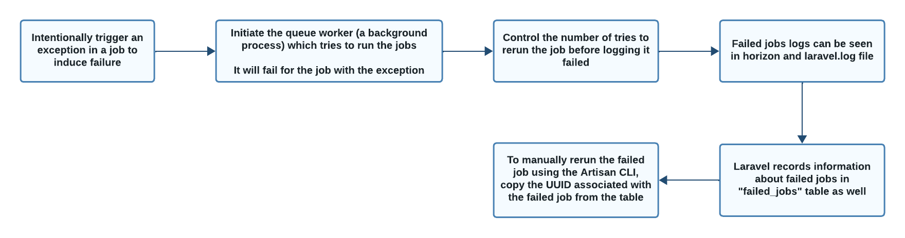
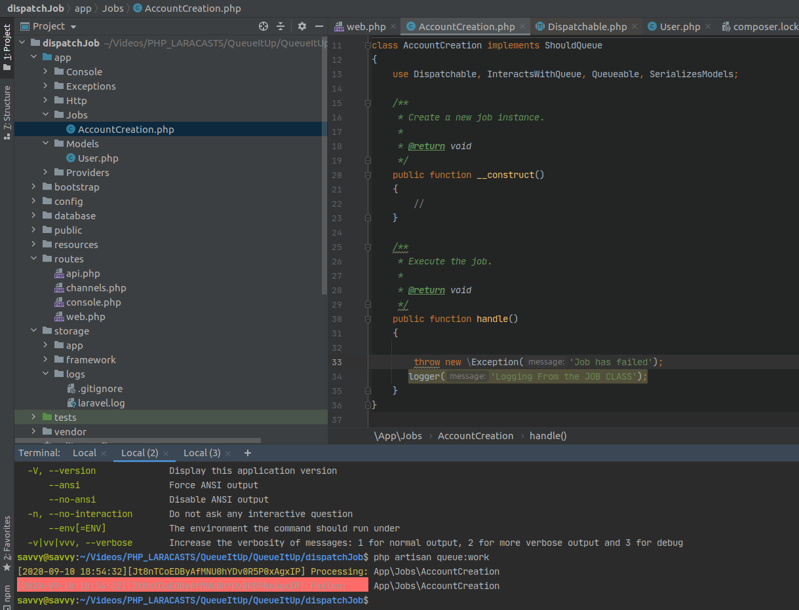
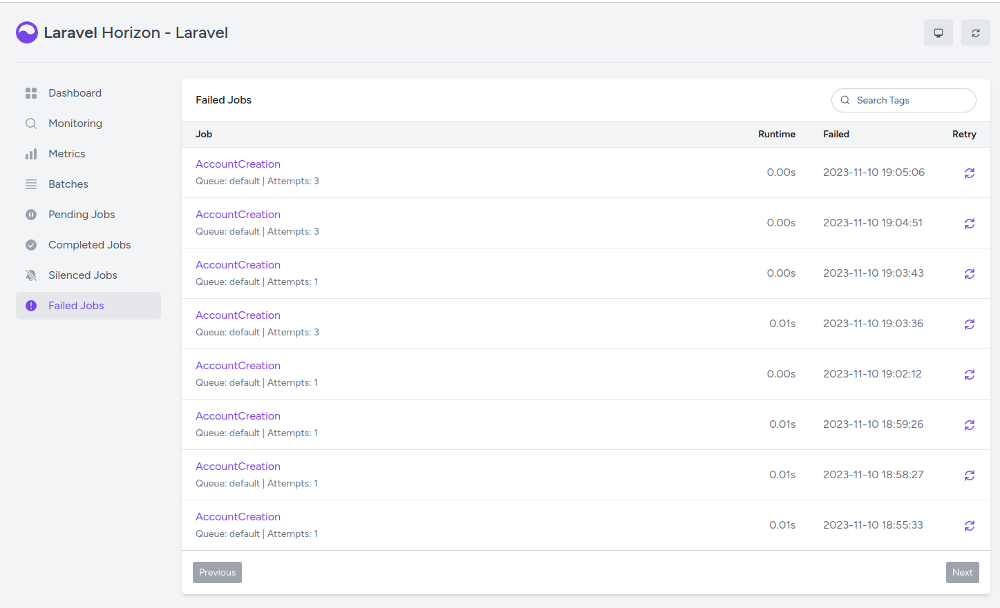
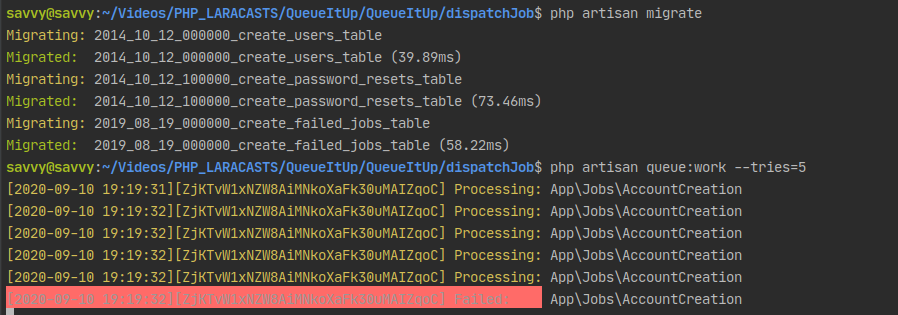

FAILED JOBS
===============

WORKFLOW OF FAILED JOBS
--------------------------

CONTROLLING THE TRIES TO RUN A JOB
------------------------------------------

Let's alter the code and throw an exception in the function

It tries to run the job, failed and didn't try to run the job again

Now let's control the number of tries to attempt the job before logging it failed by using the following attributes

.. image:: images/useTheseAttributes.png

.. code-block:: bash

   php artisan queue:work --tries=(number of tries to attempt the job before logging it failed)

.. image:: images/tries3-6.png

FAILED JOBS IN HORIZON
-----------------------------

In the Horizon dashboard, there is a section specifically for failed jobs which provides a list of failed jobs along with details about each failure.

MAKING A TABLE TO KEEP TRACK OF THE FAILED JOBS
--------------------------------------------------

Create a migration for failed jobs

.. code-block:: bash

   php artisan queue:failed-table

.. Note:: If the CreateFailedJobsTable already exists run php artisan migrate instead

Check in the created failed_jobs table

.. image:: images/table.png

Copy the UUID of the failed job if you want to retry to run the job

.. image:: images/uuid.png

Run the command for retrying

.. Note:: Remove the Exception from the class for running the job successfully this time

.. code-block:: bash

   php artisan queue:retry <copied UUID>

   php artisan queue:work

.. image:: images/retry.png

.. image:: images/run.png

COMPLETED JOBS IN HORIZON
------------------------------

.. image:: images/img.png