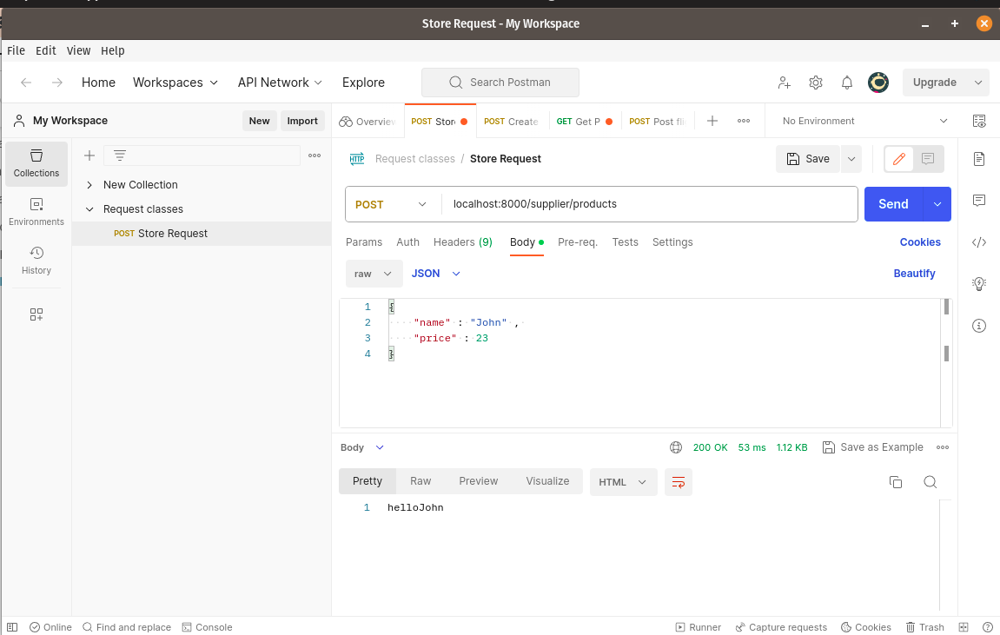

REQUEST CLASSES
==================

CREATE ROUTE
-------------

**Step 1 :**

.. code-block:: php

   Route::post('supplier/products', [ProductController::class, 'store']);

CREATE CONTROLLER
---------------------

**Step 2 :**

.. code-block:: bash

   php artisan make:controller ProductController

Now update the controller in : app/Http/Controllers/ProductController.php

.. code-block:: php

   <?php

   namespace App\Http\Controllers;

   use App\Http\Requests\StoreProductRequest;
   use Illuminate\Http\Request;

   class ProductController extends Controller
   {
    public function store(StoreProductRequest $request): string
    {
        $name = $request->get('name');
        return 'hello'. $name;
    }
   }

CREATE REQUEST CLASS
----------------------

**Step 3 :**

.. code-block:: bash

   php artisan make:request StoreProductRequest

Now update the file in : app/Http/Requests/StoreProductRequest.php

.. code-block:: php

   <?php

   namespace App\Http\Requests;

   use Illuminate\Contracts\Validation\ValidationRule;
   use Illuminate\Foundation\Http\FormRequest;

   class StoreProductRequest extends FormRequest
   {
    /**
     * Determine if the user is authorized to make this request.
     */
    public function authorize(): bool
    {
        return true;
    }

    /**
     * Get the validation rules that apply to the request.
     *
     * @return array<string, ValidationRule|array|string>
     */
    public function rules(): array
    {
        return [
            'name' => 'required',
            'supplier' => 'sometimes',
            'price'    => 'required'
        ];
    }
   }

VERIFY CSRF TOKEN
-------------------

**Step 4 :**

Update VerifyCsrfToken in : app/Http/Middleware/VerifyCsrfToken.php

.. code-block:: php

   <?php

    namespace App\Http\Middleware;

   use Illuminate\Foundation\Http\Middleware\VerifyCsrfToken as Middleware;

   class VerifyCsrfToken extends Middleware
   {
    /**
     * The URIs that should be excluded from CSRF verification.
     *
     * @var array<int, string>
     */
    protected $except = [
        'supplier/products',
        'products/*'
    ];
    }

POSTMAN
-----------

**Step 5 :**

