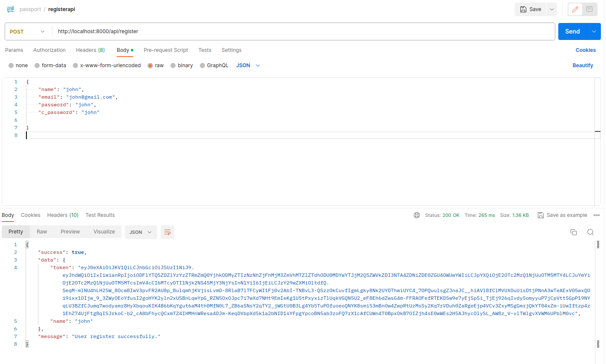
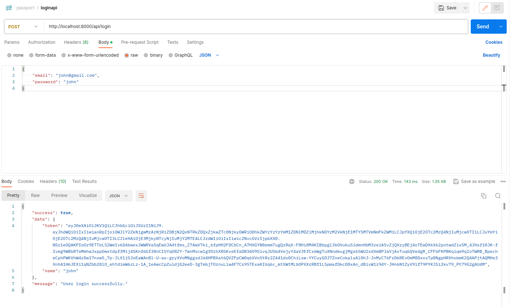
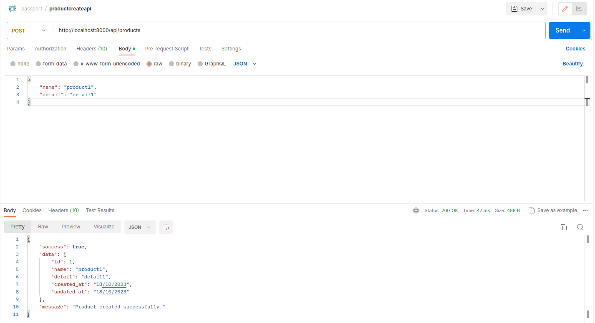
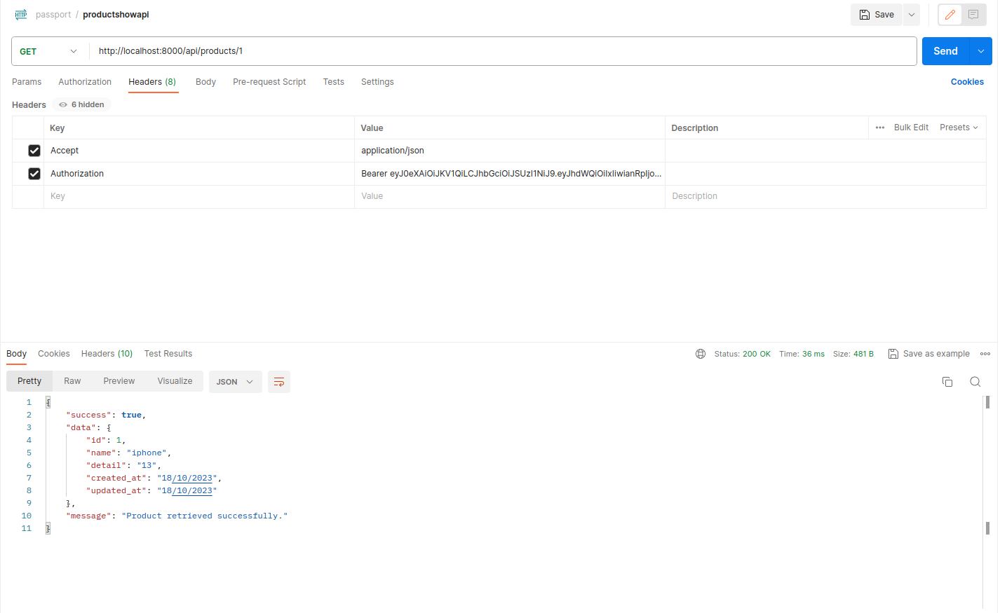
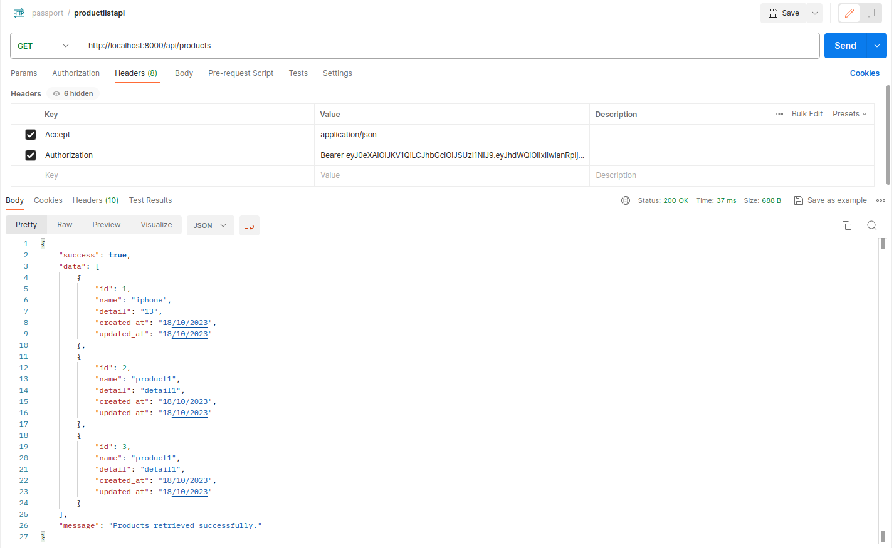
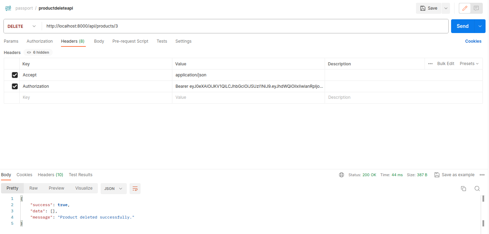

LARAVEL PASSPORT
==================

Laravel Passport is an official OAuth2 server and API authentication package provided by Laravel, one of the popular PHP frameworks. It allows secure, token-based API authentication for your Laravel applications, making it easy to build and consume APIs.

Laravel Passport implements OAuth2, which is an industry-standard protocol for authorization. It provides a secure way for users to grant third-party applications limited access to their resources without exposing their credentials.

Passport issues tokens for clients to use when accessing your API. These tokens can be either personal access tokens or access tokens obtained via OAuth2 authorization code grants.

.. image:: images/img_2.png

CREATE LARAVEL PROJECT
-----------------------

**Step 1 :**

Run the following command to create project :

.. code-block:: bash

   composer create-project laravel/laravel passport

USE PASSPORT
--------------

**Step 2 :**

In this step we need to install passport via the Composer package manager, run the following command :

.. code-block:: bash

   composer require laravel/passport

**Step 3 :**

After successfully installing the package, we require to get default migration to create new passport tables in our database. Run the following command :

.. code-block:: bash

   php artisan migrate

**Step 4 :**

Next, we need to install passport, it will create token keys for security.

.. code-block:: bash

   php artisan passport:install

PASSPORT CONFIGURATION
---------------------------

**Step 5 :**

Register HasApiTokens trait in User model of the project.

In app/Models/User.php :

.. code-block:: php

   <?php

   namespace App\Models;

   use Illuminate\Contracts\Auth\MustVerifyEmail;
   use Illuminate\Database\Eloquent\Factories\HasFactory;
   use Illuminate\Foundation\Auth\User as Authenticatable;
   use Illuminate\Notifications\Notifiable;
   use Laravel\Passport\HasApiTokens;

   class User extends Authenticatable
   {
    use HasApiTokens, HasFactory, Notifiable;

    /**
     * The attributes that are mass assignable.
     *
     * @var array
     */
    protected $fillable = [
        'name',
        'email',
        'password',
    ];

    /**
     * The attributes that should be hidden for arrays.
     *
     * @var array
     */
    protected $hidden = [
        'password',
        'remember_token',
    ];

    /**
     * The attributes that should be cast to native types.
     *
     * @var array
     */
    protected $casts = [
        'email_verified_at' => 'datetime',
    ];
   }

**Step 6 :**

Set the driver option of the api authentication guard to passport.

In config/auth.php :

.. code-block:: php

   <?php

   return [
    .....
    'guards' => [
        'web' => [
            'driver' => 'session',
            'provider' => 'users',
        ],
        'api' => [
            'driver' => 'passport',
            'provider' => 'users',
        ],
    ],
    .....
   ]

ADD PRODUCT TABLE AND MODEL
----------------------------

**Step 7 :**

Create migrations for products table :

.. code-block:: bash

   php artisan make:migration create_products_table

In database/migrations/2023_10_17_142752_create_products_table.php :

.. code-block:: php

   <?php

   use Illuminate\Support\Facades\Schema;
   use Illuminate\Database\Schema\Blueprint;
   use Illuminate\Database\Migrations\Migration;

   class CreateProductsTable extends Migration
   {
    /**
     * Run the migrations.
     *
     * @return void
     */
    public function up()
    {
        Schema::create('products', function (Blueprint $table) {
            $table->id();
            $table->string('name');
            $table->text('detail');
            $table->timestamps();
        });
    }

    /**
     * Reverse the migrations.
     *
     * @return void
     */
    public function down()
    {
        Schema::dropIfExists('products');
    }
   }

Run above migration by :

.. code-block:: bash

   php artisan migrate

**Step 8 :**

After creating "products" table you should create Product model for products :

.. code-block:: bash

   php artisan make:model Product

In app/Models/Product.php :

.. code-block:: php

   <?php

   namespace App\Models;

   use Illuminate\Database\Eloquent\Factories\HasFactory;
   use Illuminate\Database\Eloquent\Model;

   class Product extends Model
   {
    use HasFactory;

    /**
     * The attributes that are mass assignable.
     *
     * @var array
     */
    protected $fillable = [
        'name', 'detail'
    ];
   }

CREATE API ROUTES
-------------------

**Step 9 :**

In routes/api.php :

.. code-block:: php

   <?php

   use Illuminate\Http\Request;
   use Illuminate\Support\Facades\Route;

   use App\Http\Controllers\API\RegisterController;
   use App\Http\Controllers\API\ProductController;

   /*
   |--------------------------------------------------------------------------
   | API Routes
   |--------------------------------------------------------------------------
   |
   | Here is where you can register API routes for your application. These
   | routes are loaded by the RouteServiceProvider within a group which
   | is assigned the "api" middleware group. Enjoy building your API!
   |
   */

   Route::post('register', [RegisterController::class, 'register']);
   Route::post('login', [RegisterController::class, 'login']);

   Route::middleware('auth:api')->group( function () {
    Route::resource('products', ProductController::class);
   });

   Route::middleware('auth:api')->get('/user', function (Request $request) {
    return $request->user();
   });

CREATE CONTROLLER FILES
----------------------------

**Step 10 :**

In this step we have to create controller files in API folder.

Create Base Controller :

.. code-block:: bash

   php artisan make:controller API/BaseController

In app/Http/Controllers/API/BaseController.php :

.. code-block:: php

   <?php

   namespace App\Http\Controllers\API;

   use Illuminate\Http\Request;
   use App\Http\Controllers\Controller as Controller;

   class BaseController extends Controller
   {
    /**
     * success response method.
     *
     * @return \Illuminate\Http\JsonResponse
     */
    public function sendResponse($result, $message)
    {
        $response = [
            'success' => true,
            'data'    => $result,
            'message' => $message,
        ];

        return response()->json($response, 200);
    }

    /**
     * return error response.
     *
     * @return \Illuminate\Http\JsonResponse
     */
    public function sendError($error, $errorMessages = [], $code = 404)
    {
        $response = [
            'success' => false,
            'message' => $error,
        ];

        if(!empty($errorMessages)){
            $response['data'] = $errorMessages;
        }

        return response()->json($response, $code);
    }
   }

Create Register Controller :

.. code-block:: bash

   php artisan make:controller API/RegisterController

In app/Http/Controllers/API/RegisterController.php :

.. code-block:: php

   <?php

   namespace App\Http\Controllers\API;

   use Illuminate\Http\Request;
   use App\Http\Controllers\API\BaseController as BaseController;
   use App\Models\User;
   use Illuminate\Support\Facades\Auth;
   use Illuminate\Support\Facades\Validator;

   class RegisterController extends BaseController
   {
    /**
     * Register api
     *
     * @return \Illuminate\Http\JsonResponse
     */
    public function register(Request $request)
    {
        $validator = Validator::make($request->all(), [
            'name' => 'required',
            'email' => 'required|email',
            'password' => 'required',
            'c_password' => 'required|same:password',
        ]);

        if($validator->fails()){
            return $this->sendError('Validation Error.', $validator->errors());
        }

        $input = $request->all();
        $input['password'] = bcrypt($input['password']);
        $user = User::create($input);
        $success['token'] =  $user->createToken('MyApp')->accessToken;
        $success['name'] =  $user->name;

        return $this->sendResponse($success, 'User register successfully.');
    }

    /**
     * Login api
     *
     * @return \Illuminate\Http\JsonResponse
     */
    public function login(Request $request)
    {
        if(Auth::attempt(['email' => $request->email, 'password' => $request->password])){
            $user = Auth::user();
            $success['token'] =  $user->createToken('MyApp')-> accessToken;
            $success['name'] =  $user->name;

            return $this->sendResponse($success, 'User login successfully.');
        }
        else{
            return $this->sendError('Unauthorised.', ['error'=>'Unauthorised']);
        }
    }
   }

Create Product Controller :

.. code-block:: bash

   php artisan make:controller API/ProductController

In app/Http/Controllers/API/ProductController.php :

.. code-block:: php

   <?php

   namespace App\Http\Controllers\API;

   use Illuminate\Http\Request;
   use App\Http\Controllers\API\BaseController as BaseController;
   use App\Models\Product;
   use Illuminate\Support\Facades\Validator;
   use App\Http\Resources\Product as ProductResource;

   class ProductController extends BaseController
   {
    /**
     * Display a listing of the resource.
     *
     * @return \Illuminate\Http\JsonResponse
     */
    public function index()
    {
        $products = Product::all();

        return $this->sendResponse(ProductResource::collection($products), 'Products retrieved successfully.');
    }
    /**
     * Store a newly created resource in storage.
     *
     * @param  \Illuminate\Http\Request  $request
     * @return \Illuminate\Http\JsonResponse
     */
    public function store(Request $request)
    {
        $input = $request->all();

        $validator = Validator::make($input, [
            'name' => 'required',
            'detail' => 'required'
        ]);

        if($validator->fails()){
            return $this->sendError('Validation Error.', $validator->errors());
        }

        $product = Product::create($input);

        return $this->sendResponse(new ProductResource($product), 'Product created successfully.');
    }

    /**
     * Display the specified resource.
     *
     * @param  int  $id
     * @return \Illuminate\Http\JsonResponse
     */
    public function show($id)
    {
        $product = Product::find($id);

        if (is_null($product)) {
            return $this->sendError('Product not found.');
        }

        return $this->sendResponse(new ProductResource($product), 'Product retrieved successfully.');
    }

    /**
     * Update the specified resource in storage.
     *
     * @param  \Illuminate\Http\Request  $request
     * @param  int  $id
     * @return \Illuminate\Http\JsonResponse
     */
    public function update(Request $request, Product $product)
    {
        $input = $request->all();

        $validator = Validator::make($input, [
            'name' => 'required',
            'detail' => 'required'
        ]);

        if($validator->fails()){
            return $this->sendError('Validation Error.', $validator->errors());
        }

        $product->name = $input['name'];
        $product->detail = $input['detail'];
        $product->save();

        return $this->sendResponse(new ProductResource($product), 'Product updated successfully.');
    }

    /**
     * Remove the specified resource from storage.
     *
     * @param  int  $id
     * @return \Illuminate\Http\JsonResponse
     */
    public function destroy(Product $product)
    {
        $product->delete();

        return $this->sendResponse([], 'Product deleted successfully.');
    }
   }

CREATE ELOQUENT API RESOURCES
-------------------------------

**Step 11 :**

.. code-block:: bash

   php artisan make:resource Product

In app/Http/Resources/Product.php :

.. code-block:: php

   <?php

   namespace App\Http\Resources;

   use Illuminate\Http\Resources\Json\JsonResource;

   class Product extends JsonResource
   {
    /**
     * Transform the resource into an array.
     *
     * @param  \Illuminate\Http\Request  $request
     * @return array
     */
    public function toArray($request)
    {
        return [
            'id' => $this->id,
            'name' => $this->name,
            'detail' => $this->detail,
            'created_at' => $this->created_at->format('d/m/Y'),
            'updated_at' => $this->updated_at->format('d/m/Y'),
        ];
    }
   }

POSTMAN
---------

1. Register API
+++++++++++++++++

.. code-block:: bash

   http://localhost:8000/api/register

2. Login API
+++++++++++++++

.. code-block:: bash

   http://localhost:8000/api/login

.. note::

   Access token :

   .. image:: images/img.png

   In products api use following headers as listed below :

   .. code-block:: bash

      'headers' => [

       'Accept' => 'application/json',

       'Authorization' => 'Bearer '.$accessToken,

       ]

   .. image:: images/img_1.png

3. Product Create API
+++++++++++++++++++++++++

.. code-block:: bash

   http://localhost:8000/api/products

4. Product Show API
+++++++++++++++++++++

.. code-block:: bash

   http://localhost:8000/api/products/{id}

5. Product Update API
+++++++++++++++++++++++

.. code-block:: bash

   http://localhost:8000/api/products/{id}

.. image:: images/updateapi.png

6. Product List API
++++++++++++++++++++++

.. code-block:: bash

   http://localhost:8000/api/products

7. Product Delete API
++++++++++++++++++++++++

.. code-block:: bash

   http://localhost:8000/api/products/{id}

|

Github link = https://github.com/savanihd/Laravel-8-Rest-API-with-Passport

