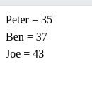

ARRAYS AND LOOPS
==================

Declaring an array
---------------------

In PHP, the array() function is used to create an array :

.. code-block:: php

    $array = ();

Example of an array :

.. code-block:: bash

   <?php
   $cars = array("Volvo", "BMW", "Toyota");
   echo "I like " . $cars[0] . ", " . $cars[1] . " and " . $cars[2] . ".";
   ?>

Result :

Associative Array

Example of an associative array :

.. code-block:: php

   <?php
   $age = array("Peter"=>"35", "Ben"=>"37", "Joe"=>"43");
   echo "Peter is " . $age['Peter'] . " years old.";
   ?>

Result :

Looping over an array (Using an array)
-------------------------------------------

To loop through and print all the values of an array, you could use a foreach loop, like this :

.. code-block:: php

   <?php
   $age = array("Peter"=>"35", "Ben"=>"37", "Joe"=>"43");

   foreach($age as $x => $val) {
   echo "$x = $val ";
   }
   ?>

Result :

