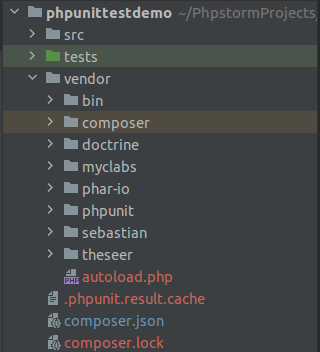
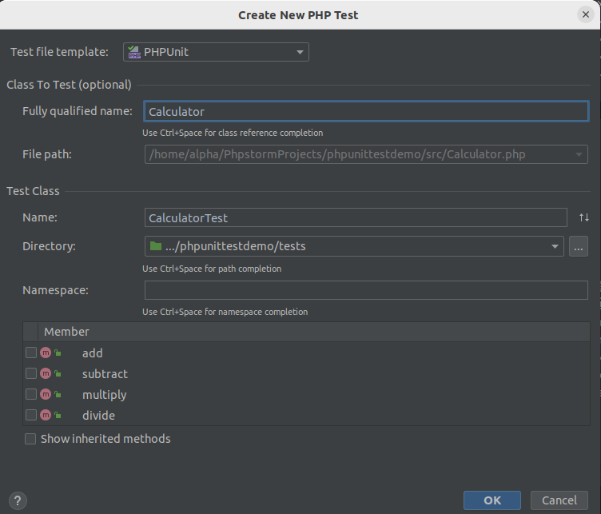
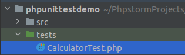
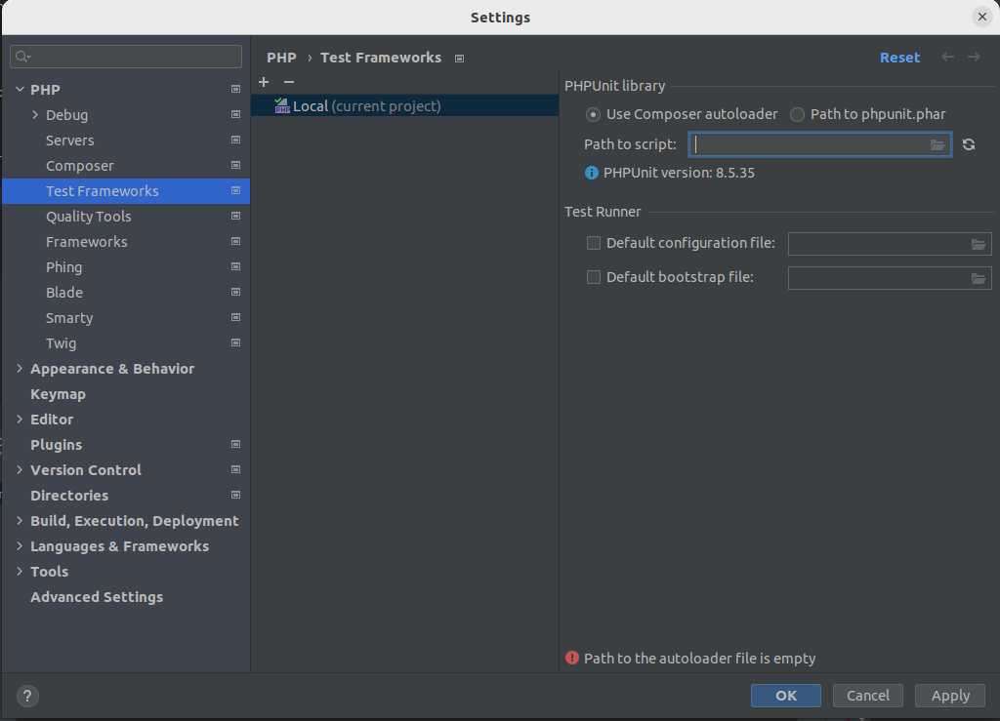
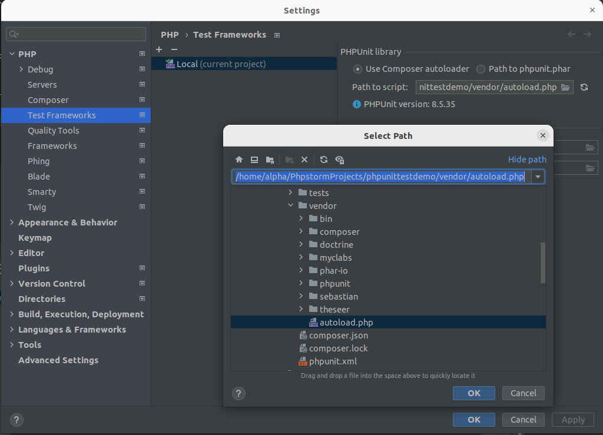
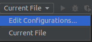
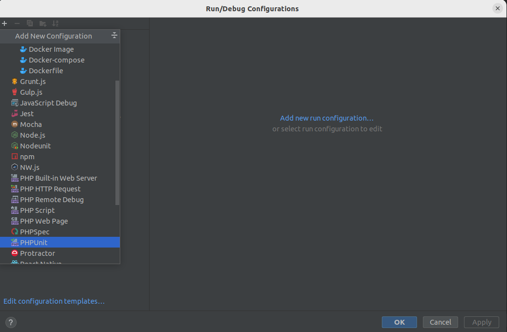
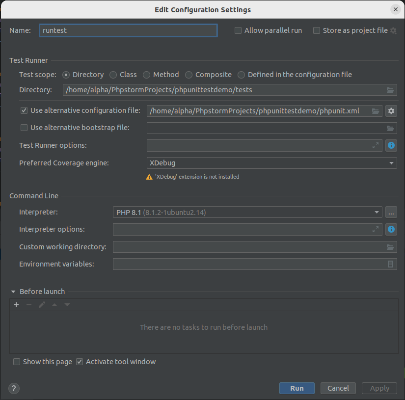

PHPUNIT TESTING
=================

SETTING UP
------------

**Step 1 :**

Create a PHP project in Phpstorm.

**Step 2 :**

Create two directories inside php project name them as “src” and “tests” as shown below.

.. image:: images/img.png

**Step 3 :**

Execute the below command in terminal to install PHPUnit :

.. code-block:: bash

   composer require --dev phpunit/phpunit ^8.5

.. image:: images/img_1.png

After executing the above command , a “vendor” folder and “composer.json” file is created.

**composer.json** file will look something like this

.. image:: images/img_3.png

WRITING TEST CASES
---------------------

**Step 4 :**

Create a phpunit.xml file in your php project.

.. image:: images/img_4.png

Open phpunit.xml file and write the configuration written below.

For bootstrap, give the path of autoload.php file.

.. code-block:: xml

        <?xml version="1.0" encoding="UTF-8"?>
        <phpunit bootstrap="vendor/autoload.php" colors = "true" verbose="true" stopOnFailure="false">
           <testsuites>
              <testsuite name="Application Test Suite">
                <directory>tests/</directory>
              </testsuite>
           </testsuites>
        </phpunit>

**Step 5 :**

Inside "src" directory create a PHP class "Calculator.php".

.. image:: images/img_5.png

Write the following code in Calculator.php :

.. code-block:: php

   <?php

   class Calculator {
    public function add($a, $b) {
        return $a + $b;
    }

    public function subtract($a, $b) {
        return $a - $b;
    }

    public function multiply($a, $b) {
        return $a * $b;
    }

    public function divide($a, $b) {
        if ($b == 0) {
            throw new InvalidArgumentException("Cannot divide by zero");
        }
        return $a / $b;
    }
   }

**Step 6 :**

Right click on "Calculator.php" class , then select New > Php Test > PhpUnit Test.

Inside Test Class section, enter name of the test class and select path of the test class directory. Click Ok.

Test class has been created under tests directory.

**Step 7 :**

Write the following code in CalculatorTest.php class.

.. code-block:: php

   <?php
   use PHPUnit\Framework\TestCase;

   require __DIR__ . "/../src/Calculator.php";

   class CalculatorTest extends TestCase
   {

    public function testAddition() {
        $calculator = new Calculator();
        $result = $calculator->add(3, 5);
        $this->assertEquals(8, $result);
    }

    public function testSubtraction() {
        $calculator = new Calculator();
        $result = $calculator->subtract(10, 4);
        $this->assertEquals(6, $result);
    }

    public function testMultiplication() {
        $calculator = new Calculator();
        $result = $calculator->multiply(2, 3);
        $this->assertEquals(6, $result);
    }

    public function testDivision() {
        $calculator = new Calculator();
        $result = $calculator->divide(10, 2);
        $this->assertEquals(5, $result);
    }

    public function testDivisionByZero() {
        $this->expectException(InvalidArgumentException::class);

        $calculator = new Calculator();
        $calculator->divide(10, 0);
    }
   }

**Step 8 :**

Go to Settings > PHP > Test Frameworks. Click on "+" button then click on "PhpUnit Local".

.. image:: images/img_8.png

**Step 9 :**

Click on icon to the right side of "Path to script".

**Step 10 :**

Select autoload.php file, click ok.

**Step 11 :**

Click on Apply then Ok.

.. image:: images/img_11.png

**Step 12 :**

Click on Edit Configurations.

Click on + icon and select PHPUnit.

**Step 13 :**

Select path of test directory and path to the "phpunit.xml" file, and also select the php version. Click Apply then Ok.

EXECUTING TESTS
------------------

**Step 14 :**

Run the tests.

.. image:: images/img_15.png

OR

To run the tests, execute the following command in the terminal :

.. code-block:: bash

   ./vendor/bin/phpunit

.. image:: images/img_17.png

